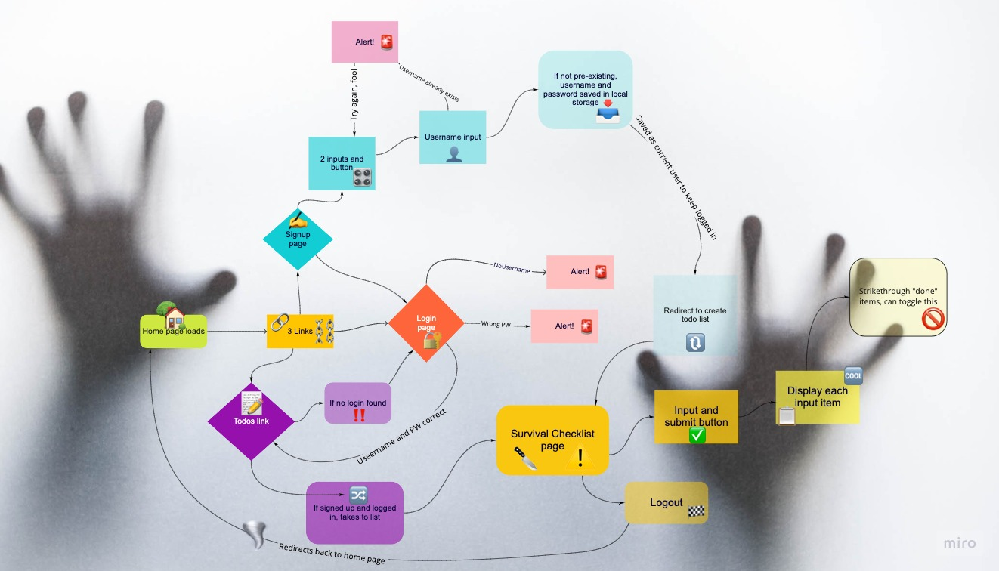

### Event
    -OnSubmit
        - put an initial user in locStor
        -send the user to `/todos`

## Login

### HTML Setup
1) Username input
2) Password input
3) Submit button

### Event
Onsubmit
    -look at username and password input, check if the user got it right (are the un and pword right?) If so, grab user from locStor
    -STRETCH: if we have the ability to store data for several users, we'll need to keep track of hwo is cuyrrently logged in. That way, we'll make sure to never show anyone else's todo accidentally
    -send the user to `/todos`

## Todos

### HTML Setup
1) Input and button to add new todo
2) a `ul` to inject todo `li` tags into

### Events
1) Click on a todo
    -We need to update this todo in locStor
        -That means we need to figure out which todo the user clicked 
        -FIND that todo in locStor
        -toggle the completion of that todo
        -save our todos
        -rerender the page with new state

2) Submit a new todo
    -Take user input and inject it into locStor as a new todo (push it into the todo array in locStor)
    -rerender the page with the new state

## Dependency order:
1) Create users
    -Why? Because the todos live on the user object!
2) Create todos
3) Complete todos
(login user)
